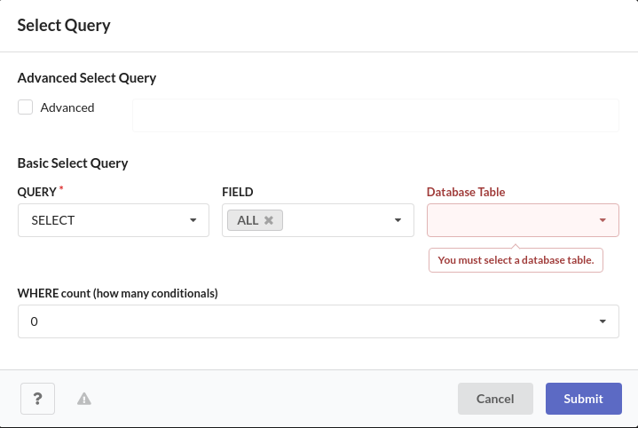
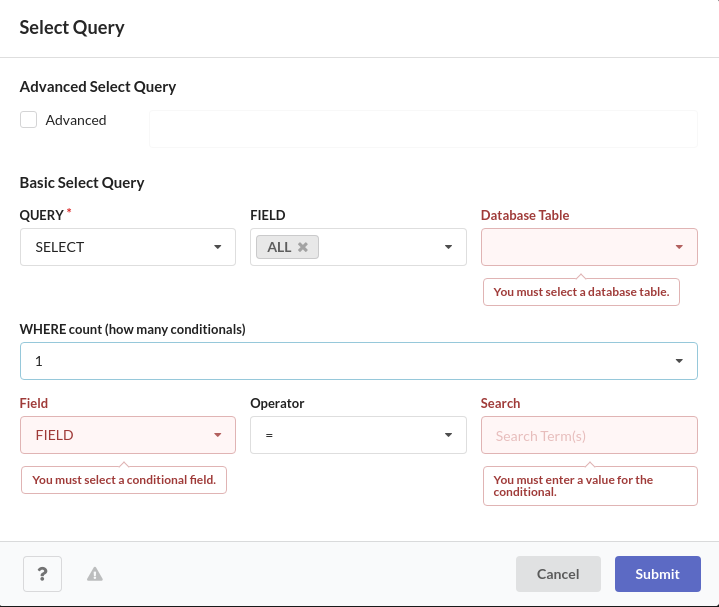
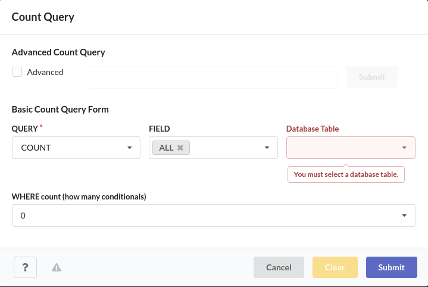
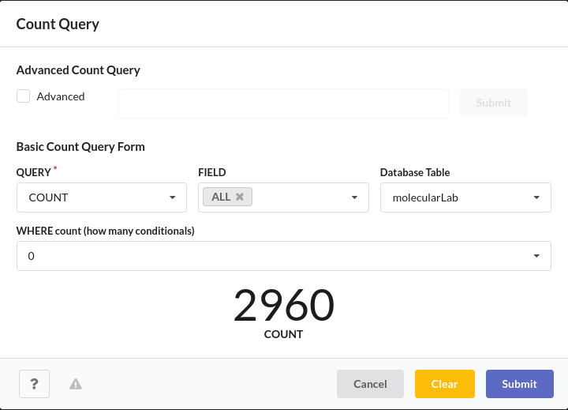
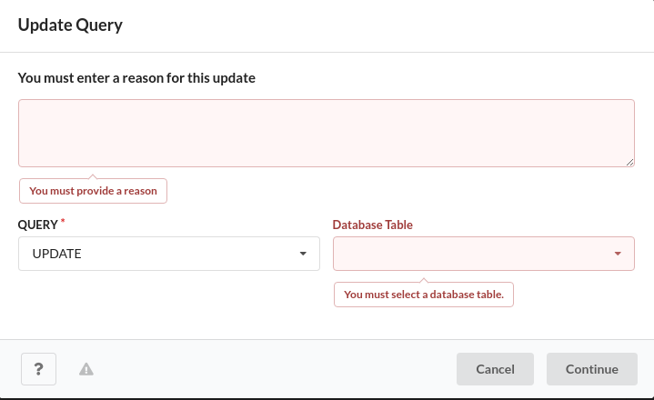
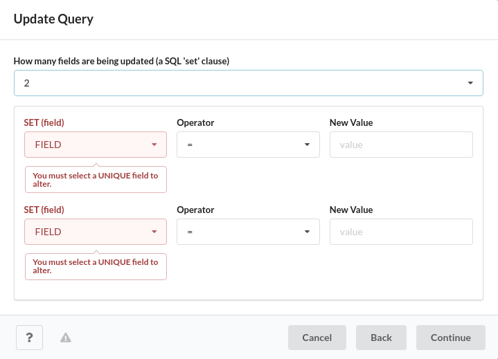
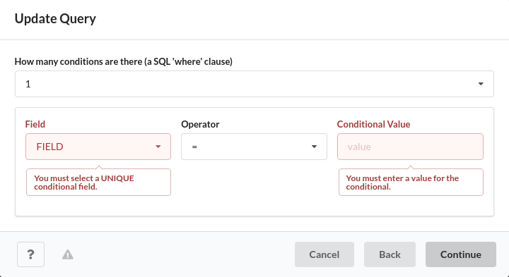
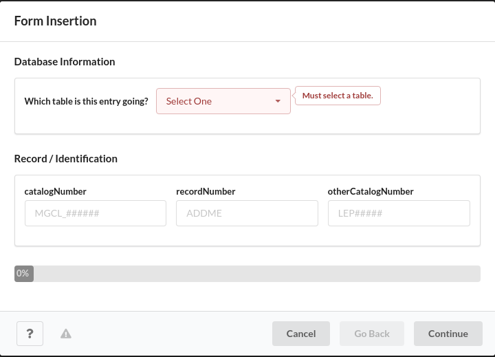
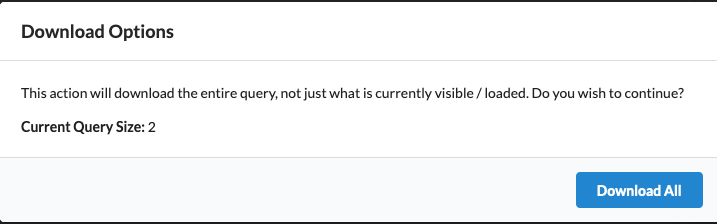

# Application Usage

A brief overview of the major features

## General

All interactable menus will have some form of an error logging functionality. Be on the lookout for the danger triangle, as this is the trigger for launching the error log modal. Each separate function has its own error log and error log modal, so if you are interacting with the select query modal and the error log button turns red, be sure to click it and see what select query related errors have occurred.

There will be help menu buttons throughout the application, tied to each interactable item. If you get lost during any of the major features, or need guidance on SQL related topics, the help menus should help.

## Header

```
/*------------------------------------------------------------------------------------------------------------*/
|  /*-----*/   /*------*/   /*--------*/                                                                       |
|  | Query |   | Insert |   | Download |                                                             username  |
|  /*-----*/   /*------*/   /*--------*/                                                                       |
/*------------------------------------------------------------------------------------------------------------*/
```

### Query Button Actions

#### Select Query Modal

The select query modal has 4 basic components: the query type (select), the fields to select, the database table to select from and the conditions (where clauses) for the selection. The modal defaults to a 'select all' set up, however you can deselect the all field and narrow the query by any amount you'd need (as long as there is at least one selected field). The general structure is as follows:



In the above example, there are 0 conditions added (the WHERE count section), and so the conditional form is hidden. As you indicate needing / needing more conditions, the appropriate number of inputs will appear. See below for another example. Also note there is an 'Advanced' checkbox, which allows for the input of a raw SQL query string. This is here for those with prior experience who would prefer hand typing the query as opposed to filling out the form. Once checked, the rest of the form will disable.



There is in-depth help provided in the help menu of the select query modal, so if you are unfamiliar with select queries in general and how they function, or how to use specific parts of the form, be sure to reference the help (the ? at the bottom left).
<br/>
<br/>

#### Count Query Modal

The count query modal has the same form structure as the select query modal, and as such I will not dive too deep into it's structure. When you make a select query, the collection table footer contains a count of how many entries / specimen were returned in the query, so it may seem unneccessary to even have this modal. The usecase is when you'd like to recieve the counts without waiting for all the data to render. For example, if there are over 7000 entries that match the conditions in a select query, 7000 entries are going to be loaded into the program, and if you really only needed to know the amount of matches that wait time is a waste.



Once a count query is complete, the count will display directly in the count query modal as such:


There is in-depth help provided in the help menu of the count query modal, so if you are unfamiliar with count queries in general and how they function, or how to use specific parts of the form, be sure to reference the help (the ? at the bottom left). Keep in mind, the true structure of a count query is slightly different, the form simplifies things a little so it reads like a traditional select query.
<br/>
<br/>

#### Update Query Modal

The update query modal has more components involved than the last two. The form is split into three pages:



On the first page, you have the inputs for the update reason (necessary to make an update), query type (always UPDATE in the update modal) and the database table the update is targeting. Once all the fields here are completed, the errors go away and you can continue onto the next page.



The following page is where you declare what fields are changing and the new values they should be recieving. You must select how many separate fields are being updated, and the appropriate number of forms will render. The newValue fields are error checked once you select a field, so you cannot update a field to an invalid state. Once you complete this section (wthout error), you can continue on to the next page.



This is the last page for the update modal form, and it is where you enter the conditions for the update. A safety measure in this program regarding update queries is that you are not allowed to query for updates without providing at least one condition. This is to prevent accidental mass updates. Once this page is completed, you will reach a confirmation page that simply states the form is completed and ready for submission.

There is in-depth help provided in the help menu of the update query modal, so if you are unfamiliar with update queries in general and how they function, or how to use specific parts of the form, be sure to reference the help (the ? at the bottom left).
<br/>
<br/>

### Insert Button Actions

#### Insert Query Paste / Drop Modal

The CSV insertion option is split up into 2 main parts: table selection and data entry. You have two methods of entering the data, either pasting the CSV into the text area or dragging and dropping the file into the drop area underneath (you may also click this area to lauch a file selection window).


It is important to note that for both options of entering the data to be inserted, you must include the headers of the CSV file. This is to ensure that the correct data is being interpretted at the correct locations in the file.

#### Insert Query Manual Entry Modal

The manual entry modal is a paginated insertion option that will guide you through entering every field in a single specimen manually.



### Download Button Actions

Clicking the download button when a select query has been loaded will launch a simple modal that will prompt whether or not you would like to download the loaded query as a csv file. Hitting download all will download the entire query, not just what is visible.


